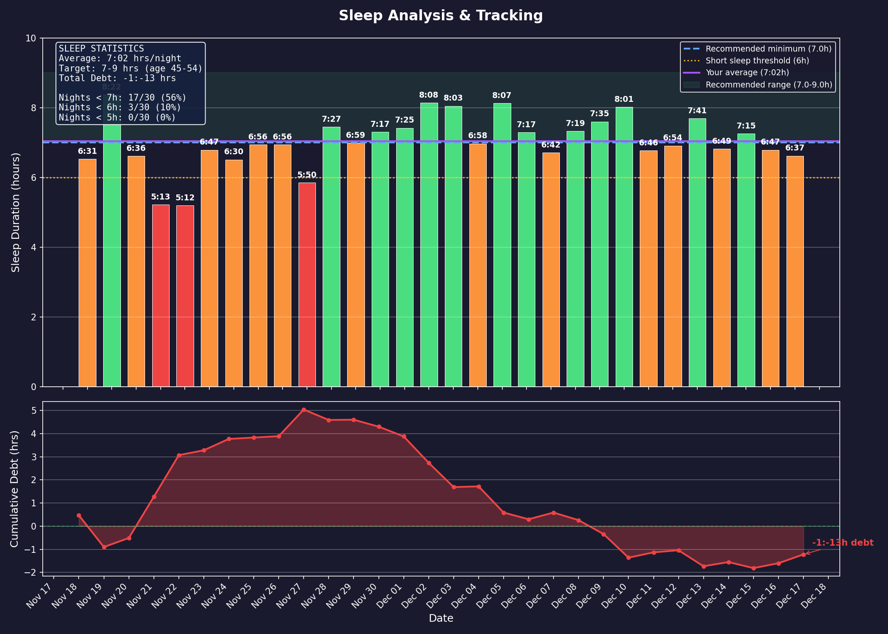
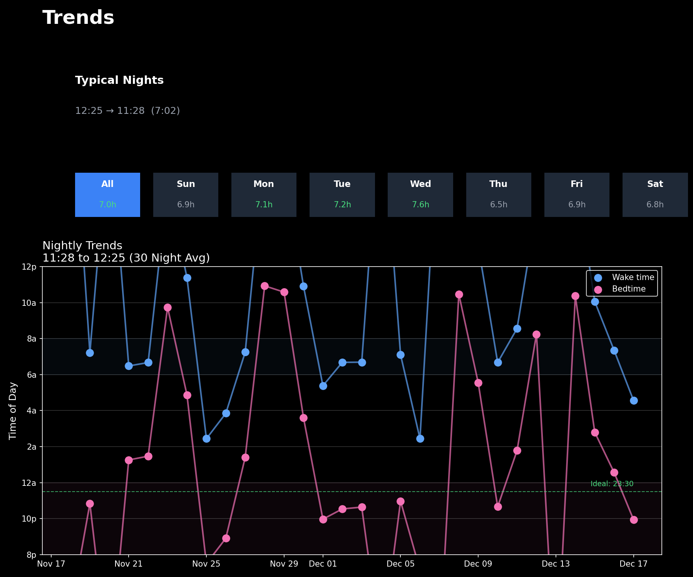
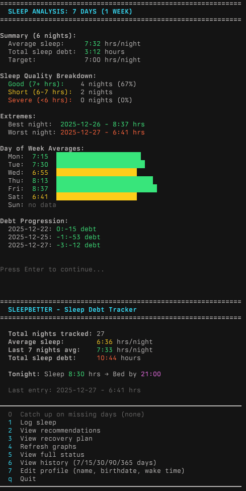

# SleepBetter CLI

A command-line sleep tracking tool that helps monitor sleep patterns, calculate sleep debt, and provides science-based recommendations for recovery.

**Author:** Houman Khosravani MD PhD FRCPC
**License:** MIT

## Overview

SleepBetter is a personal sleep debt tracker designed to help users understand their sleep patterns and recover from chronic sleep deprivation. The tool combines data logging, visualization, and personalized recommendations based on sleep science research.

### Key Features

- **Sleep Tracking**: Log bedtime, wake time, and sleep duration
- **Debt Calculation**: Automatically calculates cumulative sleep debt over time
- **Visual Analytics**: Generates beautiful dark-themed charts showing:
  - Daily sleep duration with color-coded bars
  - Progressive sleep debt over time
  - Bedtime and wake time trends
  - Day-of-week patterns
- **Personalized Recommendations**: Science-based advice for sleep recovery
- **Recovery Planning**: Multi-week recovery schedules with realistic targets
- **Interactive Mode**: Unified dashboard with menu-driven interface
- **Missing Data Detection**: Identifies and helps fill gaps in sleep logs
- **Profile Customization**: Set name, birthdate, and daily wake time with automatic age calculation
- **Wake Time Customization**: Configure your daily wake time to get accurate bedtime recommendations
- **Time-Range Filtering**: View history and graphs for 7/15/30/45/90/120/365 days
- **Dynamic Date Headers**: Graph titles adapt to data range (same month, multi-month, cross-year)
- **Robust Data Handling**: Graceful recovery from corrupted data files with automatic backup
- **Input Validation**: Clear error messages for invalid time entries

## Screenshots

### Daily Sleep Analysis

*Daily sleep duration with color-coded bars (green=healthy, yellow=short, red=severe) and progressive debt tracking*

### Sleep Trends

*Day-of-week breakdown, typical sleep timing, and bedtime/wake time trends over time*

### Interactive CLI

*Interactive command-line interface showing the main dashboard and menu options*

## Installation

### Requirements

- Python 3.7 or higher
- matplotlib (for visualizations)

### Setup

1. Clone this repository:
```bash
git clone https://github.com/neuroccm/sleepbetter.git
cd sleepbetter
```

2. Install dependencies:
```bash
pip install -r requirements.txt
```

3. Make the script executable (optional):
```bash
chmod +x sleepbetter.py
```

## Quick Start

### Interactive Mode (Recommended)

Launch the interactive dashboard with automatic visualizations:

```bash
python3 sleepbetter.py
```

On first launch, initialize with sample data:
```bash
python3 sleepbetter.py init
```

This will:
- Generate 30 days of sample sleep data
- Create and display visual charts
- Show a summary dashboard
- Present a menu of options

### Command-Line Mode

Direct commands for scripting or quick operations:

```bash
# Initialize with sample data
python3 sleepbetter.py init

# View current status
python3 sleepbetter.py status

# Log sleep for a specific date
python3 sleepbetter.py log 2026-01-07 7:30
python3 sleepbetter.py log yesterday 6:45
python3 sleepbetter.py log today 8:00

# Get personalized recommendations
python3 sleepbetter.py recommend

# View recovery plan
python3 sleepbetter.py plan

# Generate visualizations
python3 sleepbetter.py graph

# View calendar
python3 sleepbetter.py calendar
```

## Usage Guide

### Interactive Mode Menu

When running in interactive mode, you'll see:

```
============================================================
  SLEEPBETTER - Sleep Debt Tracker
============================================================

  Total nights tracked: 30
  Average sleep:        7:15 hrs/night
  Last 7 nights avg:    7:05 hrs/night
  Total sleep debt:     2:30 hours

  Tonight: Sleep 8:00 hrs → Bed by 22:30

────────────────────────────────────────────────────────────
  0  Catch up on missing days
  1  Log sleep
  2  View recommendations
  3  View recovery plan
  4  Refresh graphs (select time range)
  5  View full status
  6  View history (7/15/30/90/365 days)
  7  Edit profile (name, birthdate, wake time)
  q  Quit
────────────────────────────────────────────────────────────
```

### Logging Sleep

**Simple format (recommended):**
```bash
python3 sleepbetter.py log <date> <hours:minutes>
```

Examples:
```bash
python3 sleepbetter.py log 01-07 7:30      # January 7, 7 hours 30 minutes
python3 sleepbetter.py log yesterday 6:45   # Yesterday, 6 hours 45 minutes
python3 sleepbetter.py log today 8:00       # Today, 8 hours
```

**Detailed format:**
```bash
python3 sleepbetter.py add
```
Prompts for bedtime, wake time, and calculates duration automatically.

### Understanding the Visualizations

The tool generates two PNG charts:

**1. Sleep Daily (`sleep_daily.png`)**
- Top panel: Bar chart of daily sleep duration
  - Green bars: 7+ hours (healthy)
  - Orange bars: 6-7 hours (short sleep)
  - Red bars: <6 hours (severe deprivation)
  - Crosshatch: Tonight's target (pending)
- Bottom panel: Cumulative sleep debt over time
- Stats box: Summary statistics and percentages

**2. Sleep Trends (`sleep_trends.png`)**
- Top panel: Day-of-week breakdown and typical sleep timing
- Bottom panel: Bedtime/wake time trends over time
  - Blue line: Wake times
  - Pink line: Bedtimes
  - Green dashed line: Recommended bedtime

## Sleep Science Background

### Recommended Sleep by Age

The tool uses evidence-based sleep recommendations:
- Ages 18-64: 7-9 hours per night
- Minimum threshold: 7 hours
- Optimal for recovery: 8 hours

### Sleep Debt Recovery

Key principles implemented:
- **Gradual recovery**: Debt should be recovered over 1-2 weeks, not all at once
- **Maximum extra sleep**: ~1.5 hours per night (more causes grogginess)
- **Consistency matters**: Regular sleep schedule is more important than total hours
- **Weekend catch-up**: Helps but doesn't fully compensate for weekday deficits

### Bedtime Calculation

The tool calculates recommended bedtimes accounting for:
- **Target sleep duration**: Based on current debt and recovery needs
- **Wake time**: Your scheduled wake time (default: 6:45 AM)
- **Sleep onset latency**: 15 minutes buffer to fall asleep

Example: For 8 hours of sleep with 6:45 AM wake time:
- Target: 8 hours + 15 min buffer = 8.25 hours
- Recommended bedtime: 22:30 (10:30 PM)

## Data Storage

Sleep data is stored in `sleep_data.json` in the same directory as the script:

```json
{
  "profile": {
    "name": "Your Name",
    "birthdate": "1990-01-15",
    "age": 35,
    "target": 7.0,
    "wake_time": 6.75,
    "notes": "Sample user data"
  },
  "entries": [
    {
      "date": "2026-01-01",
      "hours": 7.25,
      "bedtime": 23.5,
      "waketime": 6.75
    }
  ]
}
```

**Profile fields:**
- `name`: Your name (displayed in graph titles)
- `birthdate`: Your birthdate in YYYY-MM-DD format (age calculated automatically)
- `age`: Calculated from birthdate, or manually set
- `target`: Target sleep hours per night
- `wake_time`: Your daily wake time in decimal hours (6.75 = 6:45 AM) - editable via menu option 7

**Time format:** Decimal hours from midnight (23.5 = 11:30 PM, 6.75 = 6:45 AM)

## Configuration

Edit these constants in `sleepbetter.py` to customize:

```python
TARGET_SLEEP = 7.0              # Minimum recommended sleep (hours)
OPTIMAL_SLEEP = 8.0             # Optimal sleep for recovery (hours)
MAX_RECOVERY_PER_NIGHT = 1.5    # Max extra sleep per night for debt recovery
DEFAULT_WAKE_TIME = 6.75        # Default wake time (6:45 AM)
```

## Advanced Features

### History Analysis

View detailed analysis over different time periods:
```bash
# In interactive mode, select option 6
# Choose from: 7, 15, 30, 45, 90, 120, 365 days, or all data
```

Provides:
- Summary statistics
- Sleep quality breakdown
- Best/worst nights
- Day-of-week patterns
- Trend analysis (improving/declining/stable)

### Recovery Planning

Generate a detailed recovery schedule:
```bash
python3 sleepbetter.py plan -w 4  # 4-week plan
```

Shows:
- Daily sleep targets
- Recommended bedtimes
- Progressive debt reduction
- Weekly milestones
- Weekend recovery opportunities

## Tips for Best Results

1. **Log consistently**: Enter data daily for accurate tracking
2. **Be honest**: Actual sleep hours matter more than aspirational ones
3. **Use bedtime recommendations**: They account for your specific debt
4. **Check visualizations**: Patterns are easier to see in graphs
5. **Review weekly**: Use the history feature to track progress
6. **Set your wake time**: Use menu option 7 to configure your daily wake time for accurate recommendations

## Troubleshooting

### Matplotlib not displaying graphs

**macOS:**
```bash
brew install python-tk
```

**Linux:**
```bash
sudo apt-get install python3-tk
```

**Windows:** Usually works by default with Python installation

### Permission denied

Make the script executable:
```bash
chmod +x sleepbetter.py
```

### Missing data file

Initialize with sample data:
```bash
python3 sleepbetter.py init
```

### Corrupted data file

If your `sleep_data.json` becomes corrupted, the tool will:
1. Display an error message
2. Automatically create a backup (`sleep_data.json.bak`)
3. Start fresh with default settings

You can manually restore from the backup if needed.

## Contributing

Contributions are welcome! Please feel free to submit issues or pull requests.

### Future Enhancement Ideas

- Apple Health / Fitbit integration
- Sleep quality metrics (deep sleep, REM)
- Correlation analysis (exercise, caffeine, etc.)
- Mobile app version
- Export to CSV
- Weekly email reports

## Acknowledgments

Built with:
- Python 3
- matplotlib for visualizations
- Sleep science research from NIH, CDC, and sleep medicine literature

## License

MIT License - see LICENSE file for details

## Author

Houman Khosravani MD PhD FRCPC

---

**Disclaimer:** This tool is for personal tracking and educational purposes. It is not a substitute for professional medical advice. If you have persistent sleep issues, consult a healthcare provider or sleep specialist.
